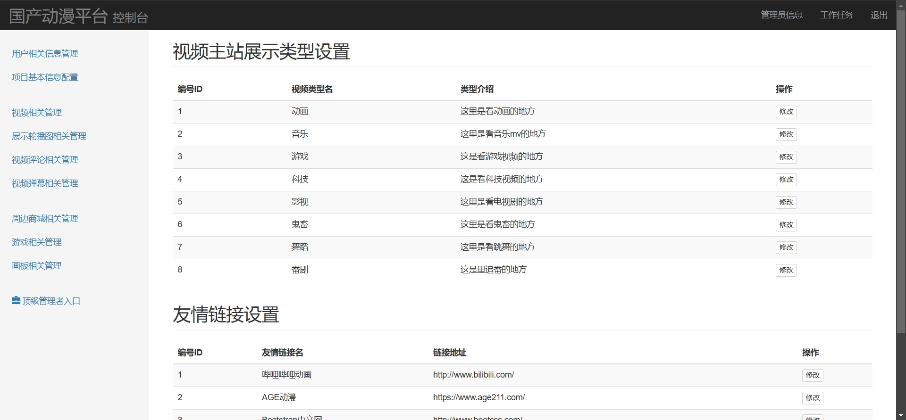

# 简易动漫管理系统(文末获取方式☟)
> 
#### 介绍
简易动漫管理系统
有BUG可留言加微

#### 软件架构
Java + SpringMVC + Mysql

#### 项目功能说明

1.  管理员功能
> + 用户相关信息管理
> + 项目基本信息配置
> + 视频相关管理
> + 展示轮播图相关管理
> + 视频评论相关管理
> + 视频弹幕相关管理
> + 周边商城相关管理
> + 游戏相关管理
> + 画板相关管理
2.  用户功能
> + 登录注册
> + 首页：轮播图、分类展示
> + 动漫分类展示、动漫详情、评论、弹幕
> + 画板展示
> + 周边商城商品展示
> + 情报资料展示
> + 个人中心：我的收藏、个人介绍

### 部分功能演示

### 环境需求(可免费提供)
- idea/eclipse、jdk-1.8、maven-3.8.6、mysql、nodejs等

## 有项目修改、安装调试需求 请联系以下

## 获取资源扫☝☝☝
